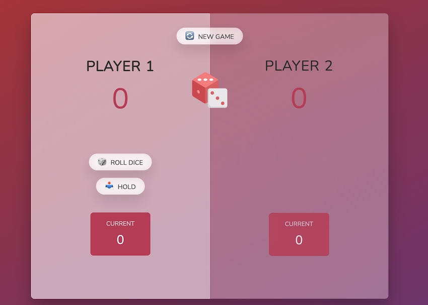

# Pig Game

## How to play

It is a simple game where two players can play.

1. The player rolls the dice and the current score is added to the total score.
2. If the player rolls a 1, all his/her current score is lost and the turn goes to the next player.
3. The player can also choose to hold the current score and the turn goes to the next player.
4. The player who scores 100 points first wins the game.

The game is built using HTML, CSS and JavaScript.

### Hosting

You can play the game <a href="https://pig-game-quizas.netlify.app/" target="_blank" rel="noopener noreferrer">here</a>
